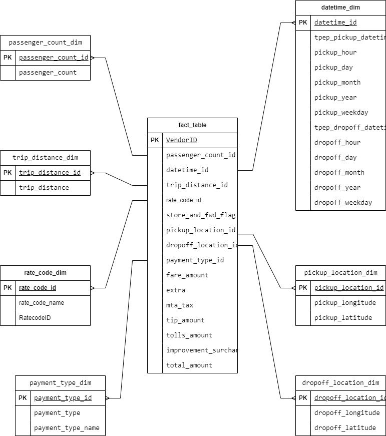

# yellow-taxi-etl-data-analysis

## Introduction

The goal of this project is to perform data analytics on Yellow Taxi data using various tools and technologies, including GCP Storage, Python, Compute Instance, Mage Data Pipeline Tool, BigQuery, and Looker Studio.

## Architecture 

## Dataset Used
TLC Trip Record Data
Yellow and green taxi trip records include fields capturing pick-up and drop-off dates/times, pick-up and drop-off locations, trip distances, itemized fares, rate types, payment types, and driver-reported passenger counts. 

[Here is the dataset used](https://github.com/Sokhaba/yellow-taxi-etl-data-analysis/blob/main/data/yellow_taxi_data.csv)

More info about dataset can be found here:
1. [Website](https://www.nyc.gov/site/tlc/about/tlc-trip-record-data.page)
2. [Data Dictionary](https://www.nyc.gov/assets/tlc/downloads/pdf/data_dictionary_trip_records_yellow.pdf)

## Data Model

## Complete Dashboard

- [Link](https://lookerstudio.google.com/s/mS0kd5sJXgU)
